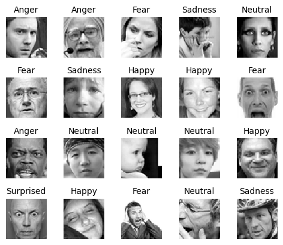
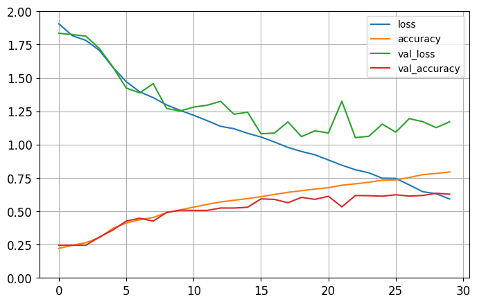

-   [Introduction](#introduction)
-   [Data Gathering](#data-gathering)
-   [Model Structure](#model-structure)
    -   [Base Model](#base-model)
    -   [Modifications](#modifications)
-   [Facial Recognition](#facial-recognition)
-   [Model Running](#model-running)
-   [Conclusion](#conclusion)
-   [Future Research](#future-research)
-   [Google Colab Notebook](#google-colab-notebook)
-   [Youtube Video Link](#youtube-video-link)

# Introduction
In this project, we are aiming to create a machine learning model that can recognize and identify emotions based on facial expressions. Human communication is composed of verbal, such as language use, and nonverbal cues, including body language, speech tone, and facial expressions. Most of the time, we express our current emotions and feelings through our facial expressions and we also read other people's affective tones through their facial expressions and modify our way of communicating with them. For example, I would never ask my mom for anything if I see her eyebrows frowned, which means she's either angry or so concentrated. So recognizing emotions and identifying them corretly is an important aspect of our communication. 

We believe emotion recognition has a variety of real-life applications and future implications in our day-to-day lives. First, a successful model could help people, especially those with developmental disability or [phychopathic traits](https://bmcpsychology.biomedcentral.com/articles/10.1186/s40359-022-00946-x) that affect their empathetic skills, recognize emotions in their daily communication and possibly increase the quality of their life. The more elaborate version of the model could even be used in increasing road safety. A [research](https://bpspsychub.onlinelibrary.wiley.com/doi/abs/10.1348/000712601162310) has shown that angry drivers take more risks on the road and have more car accidents than low-anger drivers. Emotion recognition models in combination with tiredness and attention could be beneficial to driving safety and have implications for car manufacturers. Lastly, emotion recognition could largely impact the human-machine interactions. Machines could possibly respons differently based on our emotions and mood just as we do in our human-to-human communications. It is controversial if machines should be able to understand human feelings, but it would be another big step forward in human-machine interaction. 

In this final project, we wanted to explore the capabilities of machine learning in the domain of face detection and emotion recognition. Our goal was to train a model using a large, publicly available dataset and then apply our model on handpicked real-life images that contain multiple people in various environments and backgrounds. We conducted this experiment to observe how the model would act under a new environment and how accurate the results would be.

# Data Gathering
To gather data and eventually train our model, we scoured the Kaggle website and found one [dataset](https://www.kaggle.com/competitions/challenges-in-representation-learning-facial-expression-recognition-challenge/data). The dataset consisted of around 35000 grayscale images sized 48x48 that were grouped into 7 categories of emotions: 0 - Angry, 1 - Disgust, 2 - Fear, 3 - Happy, 4 - Sad, 5 - Surprise, and 6 - Neutral. 

The dataset had been divided into 3 sets: Training, Public Test, Private Test. We used each of these sets for the training phase, the validation phase and finally the testing phase respectively.

| Emotion | Set | Pixels 
| --- | --- | --- 
|2|Training|231 212 156 164 174 138 161 173 182 200 106 38...
|0|Training|70 80 82 72 58 58 60 63 54 58 60 48 89 115 121...
|4|Training|24 32 36 30 32 23 19 20 30 41 21 22 32 34 21 1...
|...|...|...
|1|Public Test|23 53 89 184 173 173 146 194 123 170 97 45 74 34 75 44...
|4|Public Test|77 28 94 23 44 12 18 93 45 112 163 64 4 25 87 9...
|5|Public Test|4 12 0 0 0 0 0 0 0 11 26 75 3 15 23 28 48 50 58 84..
|...|...|...
|6|Private Test|50 36 17 22 23 29 33 39 34 37 37 37 39 43 48 5...
|3|Private Test|30 28 28 29 31 30 42 68 79 81 77 67 67 71 63 6...
|0|Private Test|17 17 16 23 28 22 19 17 25 26 20 24 31 19 27 9...

We chose this dataset based on its relatively small size, its consistency and completeness. Since we were tasked to create a self-sustaining notebook and make the project run seamlessly without local downloads, we decided to upload all of the dataset files to our shared Github repository. As the extracted dataset csv file was too big to upload at once, we split the dataset into 15 chunks and pushed the files to our remote repository. You can see samples of the images of the dataset below:

    

# Model Structure
To start off, we scoured the Internet in order to find an example code to start off with. Our main objective with this project is to optimize a given model in order to detect faces in other images containing human faces, so utilizing existing code was permissible. There were many solutions with varying accuracy results, and we decided on the code written by [Alpel Temel](https://www.kaggle.com/code/alpertemel/fer2013-with-keras) in Kaggle as it had a relatively high validation accuracy of 58% and used concepts we were relatively familiar with. 

## Base Model
The model itself is a sequential model that utilizes convolutional neural networks (CNNs), which is perfect for this project as CNNs are regarded to be very accurate at image recognition and classification. We have 2D convolution layers, where the kernel performs element wise multiplication and summation of results into a single output. For our activation function, we have a ReLU function in our hidden layers, as it circumvents the vanishing gradient problem, results in a better performance and converges at a faster rate than other activation functions. We have also discussed in class that the ReLU sometimes performs better than the hyperbolic tangent functions, and we have also found that to be the case in the process of hyperparameter tuning. The output layer is implemented with the softmax function and it suits our project as it is a multiclass classification problem - given the goal is to label each face with one of the seven emotions - and the softmax performs best when handling multiple classes. 

## Modifications
Our next goal was to find a way to reconfigure the model in order to increase the accuracy of the model. We added batch normalization in order to stabilize the inputs, which we believe helped the model’s output at the end. Also, we added max pooling to remove invariances, making the model detect the presence of features rather than its exact location. The specific change we made was to remove average pooling and only utilize max pooling because we believe the former wasn’t extracting important features and was causing the accuracy to be lower. Since we wanted to eventually test the model on images of tilted faces in different angles, we found max pooling to be crucial in the model’s accuracy. Moreover, we added additional layers and experimented to find the optimal solution, meanwhile considering the time we had. Utilizing the GPU engine present in Google Colab, we experimented with different number of layers and tracked the accuracies, which sometimes dropped off from the starting point of 58% accuracy. Eventually, we ended up with a model with over 20 million parameters. We ran the model and received an accuracy ouput of 65%, which was a big improvement. We will dive deeper into the model results below in the conclusion.

# Facial Recognition

After we trained our model, we wanted to apply the model in recognizing emotions in real-life images with multiple people in various scenarios. To do so, we executed the following steps:

1. Converting the image to grayscale
2. Implement pre-trained haarcascade classifier for face detection
3. Tune the hyperparameters of haarcascade
4. Predict the emotions

Let's use the below image as example for how we applied our model in "real-life" images 

1. Before performing any face detection, we first converted the image to grayscale to reduce its noise and improve computational efficiency as it is easier to identify faces in grayscale than in color. 

For face detection, we used the pre-trained haarcascade classifier built in OpenCV. This algorithm uses edge or line detection features proposed by Viola and Jones. This model is based on the sum of pixels for various facial features - such as eyes are darker than the nose and cheeks regions, and eyes are darker than the bridge of the nose - and is trained with a lot of positive images with faces and negative images with no face. We chose to use the OpenCV haarcascade classifier because it is fast and requires less computing power, making it suitable for our limited time and resource. It can also detect faces in a wide range of orientations and scales, making them versatile for a variety of situations and scenarios. However, we have later learned that the downside of the haarcascade model is that it produces many false positives. In order to reduce the number of false positive, we decided to make the filtering process a bit more strict: we increased the minNeighbors to three so false positives from the background are removed; and we modified the scaleFactor to 1.3 so the larger faces, or the main faces in the frame, can be detected faster and more accurately. These changes run the risk of missing some faces, but we think eliminating false positives is more important than missing a few true positives in terms of efficiency and accuracy.

# Model Running

Due to our limited time, resource and energy, we were able to test our model on five handpicked web images in various situations, such as a bus, classroom, theatre stage and grocery store. When selecting the images, we tried to choose images that convey day-to-day life scenerios and include multiple people with a variety of emotions. 

We detected the faces in each of the images and applied our model for each of the detected faces. The table below shows the images we tested on the left and our model's output on the right. Out of the 20 outputs given by the haarcascade classifier, our model correctly recongized the emotions of 14 of them, falsely identified the emotions of 4, and there were 2 false positives for face detection where the background was detected as a face. Even though the sample size is small, our model had a 70% of accuracy. For the mislabeled samples, all four mis-identified emotions were different - anger, happy, neutral, and surprised - and there was no specific pattern or tangible reason for why they were mislabeled.

"Real-life" images         |  Emotion recognition results
:-------------------------:|:-------------------------:
  |  
  |  
  |  
  |  
  |  

# Conclusion

In conclusion, we were able to find boilerplate code for our model and tweak the parameters in order to further improve and optimize it. The model started off having accuracy of 58% and we were able to raise to a consistent output of 65%, by the usage of batch regularization and max pooling. Looking at the result graph below we can see that there is a case of overfitting happening, which could be remedied by adding more data and reducing the number of features. The main issue that we faced in the process of conducting this research was the facial recognition system by Computer Vision library which would sometimes miss human facial features or falsely detect background areas as human faces, as we explained in detail above. This project could benefit from further research and development where we either find the optimal way of facial recognition or create a model that is fed with datasets filled with images of human faces in various angles and positions.

    

# Google Colab Notebook

Click the link below to run [our notebook](https://github.com/pard187/pard187.github.io/blob/master/Final_Project_Gormley_Giffin_Johnston_Saleh.ipynb) directly in Google Collab. No coding is required to run this notebook, you just need to run every code cell in order or simply click Runtime -> Run all and wait for all cells to run. 
Click the link below to run [our notebook](https://github.com/pard187/pard187.github.io/blob/master/Final_Project_Gormley_Giffin_Johnston_Saleh.ipynb) directly in Google Collab. No coding is required to run this notebook, you just need to run every code cell in order or simply click Runtime -> Run all and wait for all cells to run.

<table align="left">
  <td>
    
  </td>
</table>
     

# Youtube Video Link
Check out our walkthrough video [here](https://youtube.com/watch?v=IXMQVvu-zYY)!
